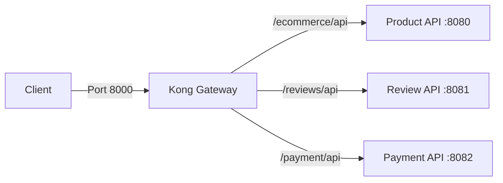

# 🦍 Kong API Gateway


This repository contains the configuration for the **API Gateway** of the E-commerce Microservices ecosystem. It uses **Kong** in **DB-less mode**, serving as the single entry point for client requests and routing them to the appropriate backend services (Products, Reviews, and Payments).

## 🏗️ Architecture

The Gateway acts as a reverse proxy, unifying the different microservices under a single domain/port and handling routing logic.



## 🚀 Key Features

* **DB-less Mode**: No database dependency (Postgres/Cassandra) is required. Configuration is loaded from a declarative YAML file (`kong.yml`) in memory, making it faster and easier to manage via Git (GitOps).
* **Centralized Routing**: Manages traffic for:
    * **Products & Users API**
    * **Reviews API**
    * **Payments API**
* **Documentation Aggregation**: Exposes Swagger UI and OpenApi docs for all underlying services through the gateway.
* **Host Networking**: Configured to resolve `host.docker.internal`, allowing seamless communication with microservices running on the host machine or exposed ports.

## 📂 Configuration Structure

```text
.
├── docker-compose.yml       # Container orchestration and env vars
└── kong/
    └── declarative/
        └── kong.yml         # The declarative configuration (Routes & Services)
```

### Route Mapping

The following routes are configured in `kong.yml`:

| Service Name | External Path (Kong) | Internal Target | Description |
| :--- | :--- | :--- | :--- |
| **Products API** | `/ecommerce/api/v1` | `localhost:8080` | Core E-commerce logic |
| **Reviews API** | `/reviews/api/v1` | `localhost:8081` | Product reviews & ratings |
| **Payment API** | `/payment/api/v1` | `localhost:8082` | Checkout & transactions |
| **Swagger UI** | `/*/api/swagger-ui` | `localhost:****` | API Documentation UI |

## 🛠️ Prerequisites

* [Docker](https://www.docker.com/)
* [Docker Compose](https://docs.docker.com/compose/)

## ⚡ Quick Start

1.  **Start the Gateway:**
    ```bash
    docker-compose up -d
    ```

2.  **Verify Status:**
    Check if Kong is running by accessing the Admin API:
    ```bash
    curl http://localhost:8001
    ```

3.  **Access Services:**
    You can now access your microservices through port `8000`.
    * *Example:* `http://localhost:8000/ecommerce/api/v1/products`

## ⚙️ Configuration Details

### `kong.yml`
This file uses the **Kong declarative format version 3.0**. It defines the Services (upstream targets) and Routes (matching rules).
* **`strip_path: false`**: This is set to ensure the context paths defined in the Spring Boot applications (e.g., `server.servlet.context-path`) are preserved when the request is forwarded.

### `docker-compose.yml`
* **`KONG_DATABASE: "off"`**: Enables DB-less mode.
* **`KONG_DECLARATIVE_CONFIG`**: Points to the mounted YAML file.
* **`extra_hosts`**: Maps `host.docker.internal` to the host gateway, allowing Kong (inside Docker) to talk to your Java apps (running on the host or exposed ports).

## 📝 Updating Configuration

To add a new service or change a route:

1.  Edit `kong/declarative/kong.yml`.
2.  Restart the container to reload the configuration (since it is read-only at startup in DB-less mode):
    ```bash
    docker-compose restart kong
    ```
    *Alternatively, you can send a POST request to the Admin API `/config` endpoint if you enable it, but restarting is safer for this setup.*

## 🤝 Troubleshooting

**Services not reachable (502 Bad Gateway)?**
* Ensure your Java microservices are running on ports `8080`, `8081`, and `8082`.
* If you are on Linux, `host.docker.internal` relies on the `extra_hosts` configuration in `docker-compose.yml`. Ensure your Docker version supports this.

## 📄 License

This project is configured for the E-commerce ecosystem.
